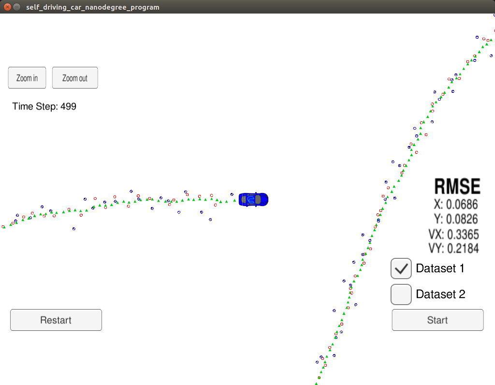
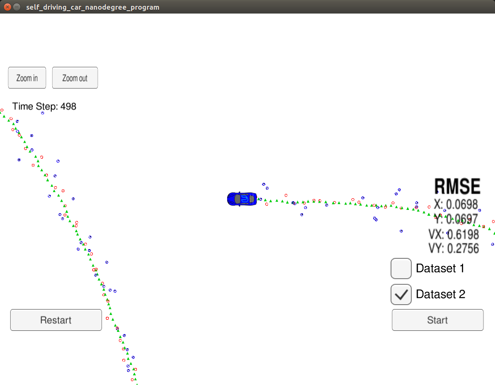

# Unscented Kalman Filter
This Project is the seventh task (Project 2 of Term 2) of the Udacity Self-Driving Car Nanodegree program. 

The main goal of the project is to apply Unscented Kalman Filter to fuse data from LIDAR and Radar sensors of a self driving car using C++.

The UKF is used to the CTRV model.

## Content of this repo
- `scr` a directory with the project code:
  - `main.cpp` - reads in data, calls a function to run the Unscented Kalman filter, calls a function to calculate RMSE
  - `ukf.h` - head file for the ukf.cpp to define the variables and functions.
  - `ukf.cpp` - initializes the filter, calls the predict function, calls the update function
  - `tools.h`- defines the functions and variables of tools.cpp
  - `tools.cpp` - a function to calculate RMSE
- [README.md](README.md) the Readme for the UKF udacity project


## Result



Accuracy - RMSE: [0.06, 0.08,  0.33,  0.21]

*Threshold*: RMSE <= [.09, .10, .40, .30]



Accuracy - RMSE: [0.06, 0.06, 0.61, 0.27]

*Threshold*: RMSE <= [.09, .10, .40, .30]


## How to run the code
Clone this repo and perform 
```
mkdir build && cd build
cmake ..
sudo make
./UnscentedKF 
```


